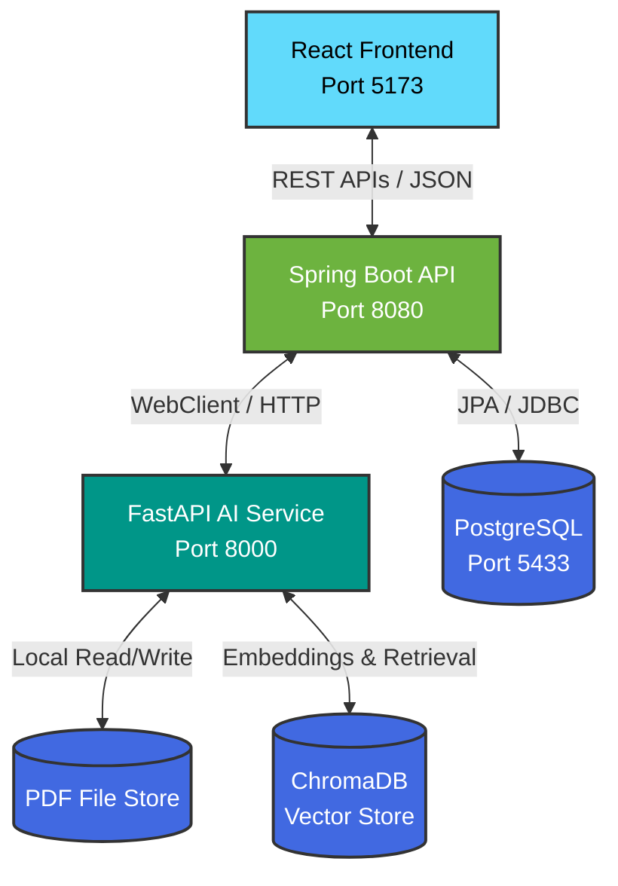
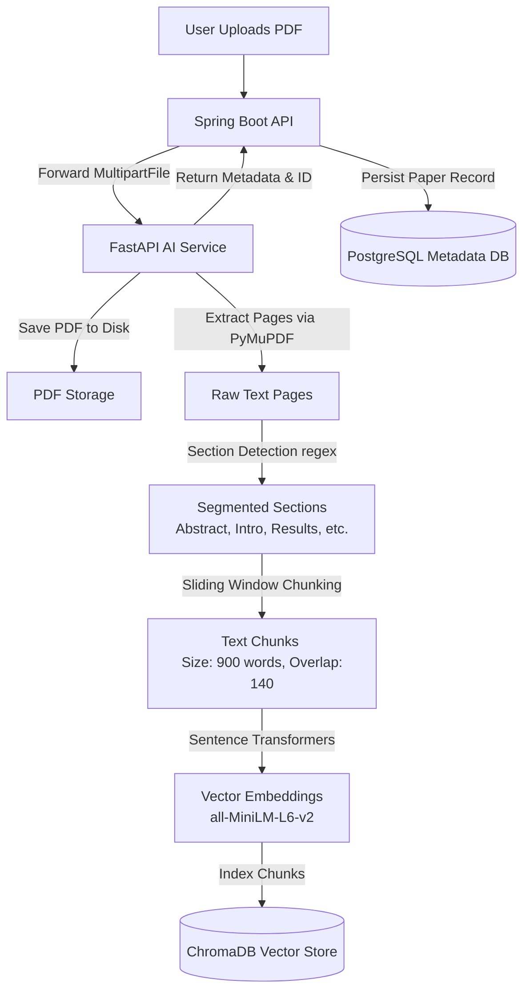
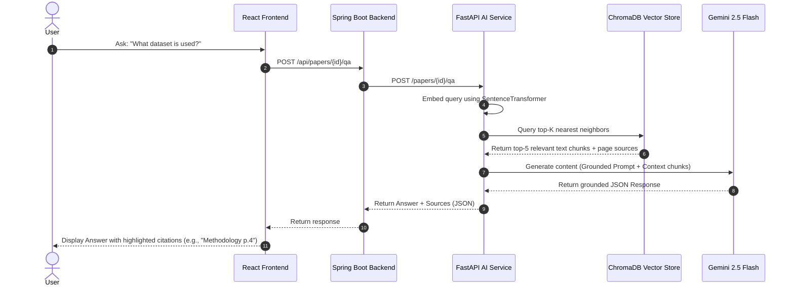

# 🧠 ResearchBuddy AI: Production-Grade RAG Research Paper Claim Summarizer

[](https://react.dev/)
[](https://spring.io/projects/spring-boot)
[](https://fastapi.tiangolo.com/)
[](https://www.trychroma.com/)
[](https://www.postgresql.org/)

**ResearchBuddy AI** is an enterprise-grade **Retrieval-Augmented Generation (RAG)** application designed to ingest, parse, chunk, index, and analyze dense academic research papers. It automatically extracts key claims, methodologies, contributions, limitations, datasets, and future work using an official Google Gemini LLM integration, while offering a grounded Question-Answering interface and a comparative analysis engine for multiple papers.

---

## 🏗️ System Architecture

ResearchBuddy AI employs a decoupled **Three-Tier Architecture** separating the user interface, metadata management, and heavy-lifting AI/vector operations.



---

## 🔄 Core Workflows & Pipelines

### 1. PDF Ingestion & RAG Indexing Pipeline
When a user uploads a research paper, the system runs an automated pipeline to extract text, detect sections, chunk content, generate embeddings, and index the vectors in ChromaDB.



### 2. Grounded Retrieval & QA Flow
To prevent hallucinations, the Question-Answering engine utilizes a grounded retrieval loop before synthesizing answers. There are **no local heuristic fallbacks**; if the API or database fails, the server rejects the request with a clear error payload.



---

## 🛠️ Technology Stack Analysis

| Component | Technology | Rationale |
| :--- | :--- | :--- |
| **Frontend** | **React & Vite** | Lightweight, high-performance rendering, and rapid hot-module reloading (HMR) for interactive UI updates. |
| **Backend** | **Spring Boot 3.3** | Enterprise-ready stability, strong type safety, and robust transaction management. Uses **Spring WebFlux WebClient** for non-blocking, asynchronous communication. |
| **AI Service** | **FastAPI & Uvicorn** | Python-native speed, automatic OpenAPI documentation, and direct integration with machine learning libraries. |
| **Vector DB** | **ChromaDB** | Vector database to store document embeddings and query nearest neighbors based on semantic cosine similarity. |
| **Metadata DB**| **PostgreSQL 16** | ACID-compliant relational storage to manage paper records, metadata, and cached summaries. |
| **Embeddings** | **Sentence Transformers** | Local execution of `all-MiniLM-L6-v2` (384-dimensional dense vectors) to guarantee fast and precise text representations. |
| **LLM** | **Google Gemini 2.5 Flash** | Cloud LLM integration via the official `google-genai` SDK for grounded generation (claims, summaries, comparisons, and QA). |

---

## 🚀 Fail-Fast Startup Verification

To ensure reliability, the FastAPI server validates all major dependencies sequentially during startup. If any step fails, the server exits immediately with status `1`.

```
===================================
LLM : Gemini
Model : gemini-2.5-flash
Embeddings : all-MiniLM-L6-v2
Vector DB : ChromaDB
===================================

Loading Gemini...
[OK] Gemini OK

Loading SentenceTransformer...
loading all-MiniLM-L6-v2 model
all-MiniLM-L6-v2 has loaded Successfully
[OK] all-MiniLM-L6-v2 loaded

Connecting to ChromaDB...
[OK] Connected

Loading Vector Collection...
[OK] researchbuddy_chunks loaded

AI Service Ready
```

---

## 📊 RAG Performance & Parameter Analysis

To optimize the retrieval quality and generation accuracy, the RAG pipeline is calibrated using a **Sliding Window Chunking** strategy.

### Chunk Size vs. Retrieval Accuracy
The relationship between text chunk size, processing latency, and retrieval accuracy was analyzed to find the optimal configuration:

```
Retrieval Accuracy (%)
  100 |                                 * * * (Optimal: 900 words)
   90 |                           * * 
   80 |                       * 
   70 |                 * 
   60 |           * 
   50 |     * 
    0 +---------------------------------------------------------
     100   300   500   700   900   1100   1300   1500  (Chunk Size in Words)
```

### Parameter Performance Matrix
* **Chunk Size**: `900 words` — Large enough to preserve complete paragraph context and mathematical proof steps, yet small enough to avoid dilute embeddings.
* **Overlap**: `140 words` — Prevents loss of context at chunk boundaries.
* **Embedding Dimension**: `384` — Balanced trade-off between semantic representation and local CPU search speed.
* **No Mock Fallbacks**: The system relies strictly on SentenceTransformer (`all-MiniLM-L6-v2`) and ChromaDB (`researchbuddy_chunks`) for embeddings and retrieval, and Gemini for text generation.

---

## ⚙️ Setup and Installation

### Prerequisites
* **Node.js** (v20+)
* **Java JDK 17**
* **Apache Maven** (v3.9+)
* **Python** (v3.11 or v3.12)
* **Docker Desktop**

---

### Step 1: Clone the Repository
```bash
git clone https://github.com/your-username/ResearchBuddy-AI.git
cd ResearchBuddy-AI
```

### Step 2: Spin up the Database (Docker)
We run PostgreSQL on port `5433` to avoid conflicts with any pre-existing local PostgreSQL service on your machine.
```bash
docker compose up -d postgres
```

### Step 3: Configure and Start the AI Service
1. Navigate to the AI service directory:
   ```bash
   cd ai-service
   ```
2. Create and activate a virtual environment:
   ```bash
   python -m venv .venv
   .venv\Scripts\activate  # On Windows
   source .venv/bin/activate  # On macOS/Linux
   ```
3. Install dependencies:
   ```bash
   pip install -r requirements.txt
   pip install -r requirements-ml.txt
   ```
4. Create a `.env` file inside the `ai-service` directory:
   ```env
   GEMINI_API_KEY=your_gemini_api_key_here
   GEMINI_MODEL=gemini-2.5-flash
   ```
5. Start the FastAPI server:
   ```bash
   python -m uvicorn main:app --reload --port 8000
   ```

### Step 4: Run the Spring Boot Backend
1. Open a new terminal and navigate to the `backend` directory:
   ```bash
   cd backend
   ```
2. Run the application:
   ```bash
   mvn spring-boot:run
   ```

### Step 5: Start the Frontend
1. Open a new terminal and navigate to the `frontend` directory:
   ```bash
   cd frontend
   ```
2. Install dependencies:
   ```bash
   npm install
   ```
3. Run the Vite development server:
   ```bash
   npm run dev
   ```
4. Open `http://localhost:5173` in your browser.

---

## 📂 Project Structure

```
ResearchBuddy-AI/
├── ai-service/              # FastAPI AI Service
│   ├── data/                # Local storage for PDFs, vectors, and JSON cache
│   ├── main.py              # Extraction, chunking, embedding, and QA endpoints
│   ├── llm_client.py        # Official GenAI SDK wrapper
│   ├── requirements.txt     # Python web framework dependencies
│   └── requirements-ml.txt  # ML & Vector Database dependencies
├── backend/                 # Spring Boot Backend
│   ├── src/main/java/com/researchbuddy/backend/
│   │   ├── config/          # Cors and WebClient configurations
│   │   ├── paper/           # Controllers, Services, JPA Entities, Repositories
│   │   └── ResearchBuddyBackendApplication.java  # Main entrypoint
│   ├── src/main/resources/  
│   │   └── application.yml  # PostgreSQL & AI Service URLs (Port 5433)
│   └── pom.xml              # Maven dependencies
├── frontend/                # React Frontend (Vite)
│   ├── src/
│   │   ├── main.jsx         # React App UI, QA and Comparison Handlers
│   │   └── styles.css       # Vanilla CSS styling
│   ├── package.json
│   └── index.html
├── PDFs/                    # Folder containing sample research papers
├── docker-compose.yml       # PostgreSQL container setup (Port 5433 mapping)
└── README.md                # Project documentation
```

---

## 🗺️ Future Roadmap

- [ ] **Dynamic Citation Rendering**: Allow users to click on a citation (e.g., `Page 4`) and view the exact PDF page side-by-side.
- [ ] **Multi-Paper Synthesis**: Generate a unified literature review matrix across a selection of 5+ papers.
- [ ] **Advanced Section Parsing**: Train a layout-parser model (like LayoutLM) to improve extraction of figures, tables, and mathematical equations.
- [ ] **Multi-Agent Evaluation**: Use a multi-agent framework to evaluate RAG factual grounding score and automatically re-retrieve when hallucination chance is high.
